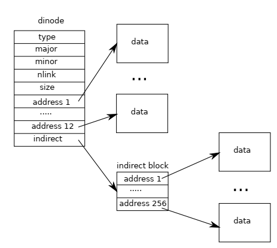

# Chapter 8: File System
### I. What's file system?
1. Support sharing of data among users and applications, and persistence so the data is still available after a reboot.
2. xv6 fs provides Unix-like files, directories and pathnames stored on a virtio disk for persistence.
### II. Challenges
1. Needs on-disk data structures to represent the tree of named directories and files.
2. Support `crash recovery`, which might interrupt a sequence of updates and leave inconsistent on-disk data structures.
3. Coordinate to maintain invariants.
4. Maintain an in-memory cache of popular blocks.
## Overview
### I. buffer cache layer
1. caches disk blocks.
2. synchronizes access, make sure only one kernel process at a time can modify the data in any particular block.
### II. logging layer
1. allows higher layers to wrap updates to several blocks in a transaction (atomic).
### III. inode layer
1. provides individual files, each as an inode with a unique i-number and some blocks holding the file's data.
### IV. directory layer
each directory as a special kind of inode whose content is a sequence of directory entries, each of which contains a file's name and i-number.
### V. pathname layer
provides hierarchical path names like `/usr/trm/xv6/fs.c`, and resolves them with recursive lookup.
### VI. file descriptor layer
abstracts many Unix resources (e.g., pipes, devices, files, etc.) using the file system interface, simplifying the lives of application programmers.
### VII. storage plan
1. `block 0` as boot sector
2. `block 1` is `superblock` which contains metadata about the file system.
3. `blocks starting at 2` hold the log
4. after the log are the `inodes`
5. after those come `bitmap blocks` tracking which data blocks are in use.
6. the remaining are `data blocks`
## Buffer cache layer
### I. interfaces - bread and bwrite
1. `bread` obtains a buf containing a copy of a block which can be read or modified in memory.
2. `bwrite` writes a modified buffer to the appropriate block on the list.
3. call `brelse` when it's done to release a buffer.
4. it uses a per-buffer sleep-lock to ensure only one thread at a time uses each buffer.
5. `bread` returns a locked buffer, `brelse` releases the lock
6. the cache use the least recently used buffer.
## Code: Buffer Cache
### I. `binit()`
buffer cache is a doubly-linked list (cycled) of buffers, length is `NBUF`.
### II. buffer states
two state fields
1. `valid`: has data been read from disk
2. `disk`: does disk "own" buf
### III. `bread`
1. `bread` calls `bget` to get a buffer for the given sector
2. if needs to be read from fisk, `bread` calls `virtio_disk_rw` to do that before returning the buffer.
### IV. `bget`
1. scans forwards to find if the buf with given device and sector numbers present, if yes, return it.
2. if not, scan backwards to find the least recently unused block and return it. (unused is indicated by `bufref`)
3. still not, it panics. It's more graceful to sleep until a buffer became free, though it may cause deadlock.
4. must be at most one cached buffer per disk sector for synchronization and ensure the user see it. It's ensured by `bache.lock`.
5. it is safe for `bget` to acquire the buffer's sleep-lock outside the `bcache.lock` critical section, since the non-zero `b->refcnt` prevents the buffer being reused for a different disk block.
### V. `bread`
once `bread`, the caller has exclusive use of the buffer and can read/write. If it writes, must call `bwrite` to change data before releasing, `bwrites` calls `virtio_disk_rw` to talk to the disk hardware.
### VI. `brelse`
it releases the sleep-lock and moves the buffer to the front of the linked list. Why move? Because it's organized by how recently it is used.
## Logging Layer
### I. how does system write to disk?
1. places a description of all the disk writes to do in a log on the disk.
2. writes a special `commit` record to the disk indicating that the log contains a complete operation.
3. copies the writes to the on-disk file system data structures.
4. erases log on disk
### II. recovery code
1. if log is marked as containing a complete operation, it copies the writes to where they belong in the on-disk file system.
2. if no, it ignores the log.
3. it finishes by erasing the log.
### III. why solve crashes problem during file system operations?
1. crash before commit -> not be marked as complete -> ignore -> repeat all the writes
2. crash after commit -> finish
## Log Design
### I. Overview
1. log is at a known fixed location, specified in the superlock.
2. consists of a header block followed by a sequence of updated block copies.
3. header block contains an array of sector numbers, one for each of the logged blocks, and the count of log blocks.
4. if count is 0 -> no transaction in the log; not 0 -> log contains a complete committed transaction with the indicated number of logged blocks.
5. a crash midway though a transaction with result count 0; after commit will result in a non-zero count.
### II. atomic
1. start and end of the sequence of writes must be atomic to crashes.
2. logging system can accumulate the writes of multiple system calls into one transaction.
3. a single commit may involve the writes of multiple complete system calls.
4. to avoid splitting system call across transactions, the logging system only commits when no file-system system calls are underways.
### III. `Group Commit`
1. reduce the number of disk operations, amortizes the fixed cost of a commit over multiple operations.
2. hands the disk system more concurrent writes at the same time.
### IV. fixed amount of space to hold the log
1. no single system call can be allowed to write more distinct blocks than there is space in the log. (a problem for `write` and `unlink`)
2. limited log space is that the logging system cannot allow a system call to start unless it is certain that the system call's writes will fit in the space remaining in the log.
## Code: Logging
### I. struct log
1. `log.outstanding`: how many FS sys calls are executing.
2. `committing`: in commit(), please wait.
### II. `begin_op()`
1. wait until the logging system is not currently committing and until there is enough unreserved log space to hold the writes from this call.
### III. `log_write`
1. is a proxy for `bwrite`.
2. records the block's sector number in memory, reserving it a slot in the log on disk, and pins the buffer in the block cache to prevent the block cache from evicting it.
3. `absorption`: absorbe several disk writes into one, file system can save log space and can achieve better performance.
### IV. `end_op`
1. decrements the count of outstanding system calls.
2. if the count is now zero, it commits the current transaction by calling `commit()`.
### V. commit()
four stages in this process
1. `write_log()` Write modified blocks from cache to log
2. `write_head()` Write header to disk -- the real commit
3. `install_trans` Now install writes to home locations
4. sets log.lh.n to 0 and `write_head()` Erase the transaction from the log
### VI. recovery
1. `fsinit` call `initlog` call `recover_from_log`.
2. `recover_from_log` reads the log header, and mimics the actions of `end_op` if the header indicates that the log contains a committed transaction.
## Code: Block Allocator
### I. bitmap
1. one bit per block, 0 is free, 1 is in use
2. `mkfs` sets the bits
### II. `balloc`
scans all blocks, find one block with bit 0, set it to 1 then return.
### III. `bfree`
1. clear the bit.
2. `balloc` and `bfree` must be called inside a transaction.
## Inode Layer
### I. two definitions
1. on-disk: containing a file's size and list of data block numbers.
2. in-memory: contains a copy of the on-disk inode as well as extra info needed within the kernel.
### II. on-disk inodes
1. packed into a contiguous area of disk.
2. Every inode is the same size. It is easy to find the nth inode on the disk. N is called the inode number or i-number.
3. `type`: files, directories and special files. type of 0: free.
4. `nlink`: counts the number of directory entries that refer to this inode. To recognize when it can be freed.
5. `size`: in byte
6. `addrs`: records the block numbers of the disk blocks holding the file's content.
### III. in-memory inodes
1. stores only if there are C pointers referring to that inode.
2. `ref` counts the pointers, when it's 0, free the in-memory inode.
3. `iget` and `iput` acquire and release pointers to an inode, modifying `ref`.
4. pointers can come from file descriptors, current working directories, and transient kernel code such as `exec`.
### IV. lock/lock-like mechanisms
1. `icache.lock`: a. inode is present in the cache at most once. b. cached inode's `ref` field counts the number of in-memory pointers to the cached inode.
2. `lock` field: sleep lock -> exclusivity.
3. `ref`: in-memory won't be freed
4. `nlink`: inode won't be free
### V. `iget`, `iput`
1. `iget()` is guaranteed to be valid until `iput()` (won't be deleted, memory won't be reused)
2. `iget()` call `ilock` and read from disk, if has not already been read, call `iunlock`
3. multiple processes can hold a C pointer to an inode returned by `iget()`, but only one can lock -> prevents deadlock.
### VI. `iupdate()`
mainly job is synchronization rather than caching.
## Code: Inodes
similar to buffer cache
### I. `ialloc`
1. similar to `balloc`, loops over the inodes, find free one, then write `type` to claim it. 
2. returns an entry from inode cache with tail call to `iget`
3. it's designed that way only one process at a time can be holding a reference to `bp`.`
### II. `iget`
1. looks through the inode cache for an active entry(`ip->ref` > 0) with the desired device and inode number.
2. if finds one, it returns new reference to that inode.
3. as `iget` scans. it records the position of the first empty slot.
### III. `ilock`
1. lock the inode using `ilock` before reading or writing its metadata or content. 
2. `ilock` uses a sleep-lock for this purpose
3. once it has exclusive access, it reads from disk.
### IV. `iput`
1. releases a C pointer to an inode by decrementing the reference count. If last reference, inode's slot in the inode cache is now free and can be reused for a different inode.
2. if `ref` drops to 0, it release the inode and data blocks, it call `itrunca` to truncate the file to zero bytes. But it's not same for `link`
3. locking protocol. One danger is that a concurrent thread might be waiting in `ilock` to use this inode and won't be prepared to find that the inode is not longer allocated. This can't happen because there is no way for a system call to get a pointer to a cached inode if it has no linkes to it and `ip->ref` is one.
4. `iput()` can write to the disk, means any system call uses the file system may write the disk even read-only. This, in turn, means that even read-only system calls must be wrapped in transactions if they use the file system.
### V. challenge
1. challenge: `iput()` doesn't truncate a file immediately when link count drops to 0. If a crash happens before the last process closes the file descriptor, the file will be marked allocated but no directory entry will point to it.
2. solution 1: on recovery, scans whole file system for files that marked allocated but no directory entry pointing to them.
3. solution 2: use a list to record on disk the inode number of a file whose link count drops to 0 but whose reference count is not 0. On recovery, the file system frees any file in the list.
## Code: Inode Content
### I. on-disk inode structure

### II. `bmap`
`bmap` allocates blocks as needed. An `ip->addrs[]` or indirect entry of zero indicates that no block is allocated. As `bmap` encounters zeros, it replaces them with the numbers of fresh blocks, allocated on demand.
### III. `itrunc`
`itrunc` calls `bfree` to free a file's block (direct blocks, indirect block list, indirect block itself), resets the inode's size to 0.
### IV. `readi` and `writei`
1. `readi`: if offset larger than size, return 0, but if offset + n larger than size, return fewer bytes. The main loop processes each block of the file, copying data from the buffer into `dst`.
2. `writei` is identical to `readi` except: offset + n larger than size -> grow file size (up to the maximum size). Then update size. 
### V. `stati`
copies inode metadata into the `stat` structure, which is exposed to user programs via the `stat` system call.
## Code: Directory Layer
### I. Overview
1. type `T_DIR` and its data is a sequence of directory entries. 
2. Each is a `struct dirent` which contains a name and an inode number. Name is at most `DIRSIZ(14)` chars and terminated by a NUL(0).
### II. `dirlookup`
searches a directory for an entry with given name. If finds one, it sets `*poff` to the byte offset of the entry within the directory and return a pointer to the corresponding inode (unlocked).
### III. `dirlink`
writes a new directory entry with the given name and inode number into the directory `dp`. 
## Code: Path Names
### I. Overview
1. path name lookup involves a seccession of calls to `dirlookup`, one for each component.
2. `namei` evaluates path and returns the corresponding `inode`.
3. `nameiparent` is a variant: it copy the final element into `name` and return the inode of the parent directory.
4. both call the generalized function `namex` to do the real work.
### II. `namex`
1. it uses `skipelem` to consider each element of the path in turn.
2. each iteration of the loop locks `ip` and check that it is a directory. If not the lookup fails. (locking is necessary because until `ilock` runs, `ip->type` is not guaranteed to have been loaded from disk)
3. loop looks for the path element using the `dirlookup` and prepare for the next iteration by setting `ip next`.
4. when the loop runs out of path elements, return the unlocked `ip`
5. could be slow and take several disk operations to read inodes and directory blocks for the directories traversed in the pathname.
### III. Concurrency challenges
1. race condition. For example, one kernel thead is looking up a pathname, another changing the directory tree by unlinking a directory.
2. xv6 avoids such races. (`iget` doesn't use lock, only ref count)
3. deadlock. For example, `next` points to the same node as `ip` when looking up ".". Locking `next` before releasing the lock on `ip` would result in a deadlock. 
4. to avoid this, `namex` unlocks the directory before obtaining a lock on `next`. Here we see the separation between `iget` and `ilock` is important.
## File Descriptor Layer
### I. Overview
console, pipes real files are represented as files. File descriptor layer is the layer that archieves this uniformity.
### II. file table
1. each process has its own table of open files, or file descriptors.
2. each open file is represented by a `struct file`, which is a wrapper around either an inode or a pipe, plus an I/O offset.
3. each call to `open` creates a new open file (a new `struct file`), if multiple processes open the same file independently, the different instances will have different I/O offsets.
4. a single open file (the same `struct file`) can appear multiple times in one process's file table and also in the tables of multiple processes. (may happen with `dup` or `fork`)
5. reference count tracks the number of reference to a particular open file.
### III. `filealloc`, `filedup`, `fileclose`
1. `filealloc`: allocate a file
2. `filedup`: create a duplicate reference
3. `fileclose`: release a reference and read and write data
### IV. `filestat`, `fileread`, `filewrite`
implement the `stat`, `read` and `write` operations on files
1. `filestat` is only allowed on inodes and calls `stati.Fileread`
2. `filewrite` check that the operation is allowed by the open mode and then pass the call through to either the pipe or inode implementations
3. if the file represents an inode, `fileread` and `filewrite` use the I/O offset as the offset for the operation and then advance it.
4. pipes have no concept of offset.
5. caller to handle locking. 
6. In inode locking, read and write offsets are updated atomically, so that multiple writing to the same file simultaneously cannot overwrite each other's data.
## Code: System Calls
### I. `sys_link` `sys_unlink`
1. edit directories, creating or removing reference to inodes.
2. `sys_link(string old, string new)`. 
3. Assuming `old` exists and is not a directory, increments `ip->nlink`. 
4. Then calls `nameiparent` to find the parent directory and final path element of `new` and creates a new directory entry pointing at `old`'s inode.
5. new parent directory must exist and be on the same device as the old. inode numbers only unique on a single disk. If error like this occurs, `sys_link` must go back and decrement `ip->nlink`.
### II. `create`
1. used in three system calls: `open` with the `O_CREATE` flag, `mkdir`, `mkdev`.
2. starts by caling `nameiparent`, then `dirlookup` to check the name already exists.
3. in `open` if already exist, safe; otherwise, error.
4. if new inode is a durectory, `create` initializes it with `.` and `..`.
5. finally, `create` link it into the parent directory. 
6. like `sys_link`, `create` holds two locks simultaneously: `ip` and `dp`. There is no possibility of deadlock because the inode `ip` is freshly allocated: no other process in the system will hold `ip`'s lock and then try to lock `dp`.
7. using `create`, it is easy to implement `sys_open`, `sys_mkdir` and `sys_mknod`. 
8. no other process can access the partially initialized file since it is only the current process table.
## Real World
### I. Buffer Cache
1. purposes: a. caching b. synchronizing access to the disk
2. a more efficient LRU cache would eliminate the linked list, instead use a hash table for lookups and a heap for LRU evictions.
3. modern buffer caches are typically integrated with the virtual memory system to support memory-mapped files.
### II. Logging System
problems with xv6
1. a commit cannot occur concurrently with file-system system calls.
2. the system logs entire blocks, even if only a few bytes in a block are changed.
3. synchronous log writes, a block at a time, each of which is likely to require an entire disk rotation time.
### III. Scavenger
1. another way for crash recovery, trigger during reboot (`fsck` program) to examine every file and directory and the block and inode free lists
2. looking for and resolving inconsistencies. Scavenging can take hours for large file system, the there are situations cannot be sovled atomically.
3. recovery from a log is much faster and causes system calls to be atomic in the face of crashes
### IV. On-disk Layout of Inodes and Directories
1. `BSD's UFS/FFS` and `Linux's ext2/ext3` use the same data structures. But the directory lookup is inefficient, linear scan.
2. `Window's NTFS`, `Mac OS X's HFS` and `Solaris's ZFS` implements a directory as an on-disk balanced tree of blocks. This is complicated but guarantees O(logN) directory lookups.
### V. Disk Failures
1. xv6 is naive, once disk operation fails, xv6 panics.
2. operating systems using plain disks should expect failures and handle them more gracefully, so that the loss of a block inone file doesn't affect the use of the rest of the file system.
### VI. One Disk per File System
1. solution: combine many disks into a single logical disk.
2. Hardware solutions such as RAID are the most popular, but the current trend is moving toward implementing as much of this logic in software as possible.
3. these software implementations typically allow rich functionality like growing or shrinking the logical device by adding or removing disks on the fly, which requires the file system to do the same. 
4. seperating disk management from the file system may be the cleanest design, but the complex interface between the two has led some systems, like `Sun's ZFS` to combine them.
### VII. xv6 lack features
such as snapshots and incremental backup
### VIII. Resources
1. named pipes, network connections, remotely-accessed network file systems, and monitoring and control interfaces such as `/proc`.
2. instead of xv6's `if` statements in `fileread` and `filewrite`, these systems typically give each open file a table of function pointers, one per operation, and call the function pointer to invoke that inode's implementation of the call.
3. Network file systems and user-level file systems provide functions that turn those calls into network RPCs and wait for the response to be returning.
